# Multi-Agent System Workflow Diagrams

## 1. Multi-Agent Workflow

This diagram shows the five agents, their responsibilities, and how the Orchestrator coordinates the workflow.

```mermaid
flowchart TD

    R["Customer Request<br/>Items, quantities, request date, deadline"]

    O1["Orchestrator Agent<br/>Routes request for inventory assessment"]

    I["Inventory Agent<br/>Checks product support, stock,<br/>replenishment timing, and affordability"]

    D1{"Orchestrator:<br/>Can the full order be fulfilled?"}

    X["Customer Response<br/>Explains why the order cannot be completed"]

    O2["Orchestrator Agent<br/>Routes feasible request for quoting"]

    C1["Commercial Agent - Quote Mode<br/>Generates prices, discounts,<br/>line totals, and final quote"]

    O3["Orchestrator Agent<br/>Sends quote for customer evaluation"]

    U1["Customer Agent<br/>Evaluates the quote and returns<br/>ACCEPT, COUNTER, or REJECT"]

    D2{"Orchestrator:<br/>What did the customer decide?"}

    O4["Orchestrator Agent<br/>Routes accepted quote for fulfillment"]

    C2["Commercial Agent - Sale Mode<br/>Finalizes the accepted order<br/>and records the sale"]

    O6["Orchestrator Agent<br/>Checks the fulfillment result<br/>and prepares the final response"]

    S["Customer Response<br/>Confirms the order and delivery details"]

    O5["Orchestrator Agent<br/>Routes counteroffer for one revised quote"]

    C3["Commercial Agent - Quote Mode<br/>Generates a revised quote<br/>using the counteroffer context"]

    U2["Customer Agent<br/>Evaluates the revised quote<br/>and returns ACCEPT or REJECT"]

    D3{"Orchestrator:<br/>What is the final decision?"}

    B["Business Advisor Agent<br/>Reviews the completed sale and<br/>suggests operational improvements"]

    R --> O1

    O1 -->|"Request details"| I
    I -->|"Fulfillment status + reasons"| D1

    D1 -->|"No"| X
    D1 -->|"Yes"| O2

    O2 -->|"Quote request"| C1
    C1 -->|"Quote + pricing"| O3

    O3 -->|"Original request + quote"| U1
    U1 -->|"Decision"| D2

    D2 -->|"REJECT"| X

    D2 -->|"ACCEPT"| O4
    O4 -->|"Accepted quote"| C2
    C2 -->|"Sale result + fulfillment dates"| O6

    O6 -->|"Successful order"| S

    O6 -.->|"Optional business analysis"| B
    B -.->|"Internal recommendations"| O6

    D2 -->|"COUNTER"| O5
    O5 -->|"Counteroffer context"| C3
    C3 -->|"Revised quote"| U2
    U2 -->|"Final decision"| D3

    D3 -->|"REJECT"| X
    D3 -->|"ACCEPT"| O4
```

The Orchestrator, Commercial Agent, and Customer Agent appear more than once to show different stages of the workflow. There are five agents in total.

---

## 2. Agent Tools and Starter Helpers

This diagram shows which tools belong to each agent, what each tool does, the data passed between the agent and tool, and the starter helper functions used by each tool.

```mermaid
flowchart TB

    %% =====================================================
    %% ROW 1 - ORCHESTRATOR
    %% =====================================================

    subgraph R1["Orchestrator"]
        direction LR

        O["Orchestrator Agent<br/>Routes work to specialist agents"]

        OT["Delegation tools<br/><br/>delegate_inventory()<br/>delegate_commercial()<br/>delegate_customer()<br/>delegate_business_analysis()<br/><br/>Purpose:<br/>Send tasks to the appropriate worker agent"]

        OH["Starter helpers<br/><br/>None<br/><br/>These tools only delegate work to other agents"]

        O -->|"Input: request + task<br/>Output: worker-agent response"| OT
        OT -->|"Uses"| OH
    end


    %% =====================================================
    %% ROW 2 - INVENTORY
    %% =====================================================

    subgraph R2["Inventory"]
        direction LR

        I["Inventory Agent<br/>Checks fulfillment feasibility"]

        IT["check_inventory_batch()<br/><br/>Purpose:<br/>Check all requested items and determine whether the complete order can be fulfilled"]

        IH["Starter helpers<br/><br/>get_stock_level()<br/>get_supplier_delivery_date()<br/>get_cash_balance()<br/><br/>Used through check_inventory()"]

        I -->|"Input: items + quantities<br/>Output: item results + overall fulfillment status"| IT
        IT -->|"Uses"| IH
    end


    %% =====================================================
    %% ROW 3 - COMMERCIAL QUOTE
    %% =====================================================

    subgraph R3["Commercial Agent - Quote Generation"]
        direction LR

        CQ["Commercial Agent<br/>Generates customer quotes"]

        QT["calculate_quote()<br/><br/>Purpose:<br/>Calculate catalog pricing, bulk discount, line totals, and final quote"]

        QH["Starter helper<br/><br/>search_quote_history()<br/><br/>Accessed through search_historical_quotes()"]

        CQ -->|"Input: items + quantities + search terms<br/>Output: line totals + discount + final quote"| QT
        QT -->|"Uses historical quote data from"| QH
    end


    %% =====================================================
    %% ROW 4 - COMMERCIAL HISTORY SEARCH
    %% =====================================================

    subgraph R4["Commercial Agent - Historical Quote Search"]
        direction LR

        CH["Commercial Agent<br/>Retrieves previous quote information"]

        HT["search_historical_quotes()<br/><br/>Purpose:<br/>Find relevant historical quotes for pricing context"]

        HH["Starter helper<br/><br/>search_quote_history()"]

        CH -->|"Input: search terms<br/>Output: matching historical quotes"| HT
        HT -->|"Uses"| HH
    end


    %% =====================================================
    %% ROW 5 - COMMERCIAL SALE
    %% =====================================================

    subgraph R5["Commercial Agent - Sales Fulfillment"]
        direction LR

        CS["Commercial Agent<br/>Finalizes accepted sales"]

        FT["fulfill_order_item()<br/><br/>Purpose:<br/>Fulfill accepted items, replenish shortages when needed, and record the sale"]

        FH["Starter helpers<br/><br/>get_stock_level()<br/>get_supplier_delivery_date()<br/>get_cash_balance()<br/>create_transaction()<br/><br/>reorder_inventory() is used internally when stock is short"]

        CS -->|"Input: accepted item + exact quantity<br/>Output: success/failure + sale price + fulfillment date"| FT
        FT -->|"Uses"| FH
    end


    %% =====================================================
    %% ROW 6 - CUSTOMER
    %% =====================================================

    subgraph R6["Customer"]
        direction LR

        U["Customer Agent<br/>Evaluates and negotiates the quote"]

        UT["No business tools<br/><br/>Purpose:<br/>Evaluate the current offer using customer context"]

        UR["Input:<br/>Original request + current quote<br/><br/>Output:<br/>ACCEPT / COUNTER / REJECT"]

        U -->|"Text context"| UT
        UT -->|"Decision"| UR
    end


    %% =====================================================
    %% ROW 7 - BUSINESS ADVISOR
    %% =====================================================

    subgraph R7["Business Advisor"]
        direction LR

        B["Business Advisor Agent<br/>Analyzes internal business health"]

        BT["get_business_health()<br/><br/>Purpose:<br/>Collect financial and inventory information for internal analysis"]

        BH["Starter helpers<br/><br/>generate_financial_report()<br/>get_cash_balance()<br/>get_all_inventory()"]

        B -->|"Input: as-of date<br/>Output: financial report + cash + inventory context"| BT
        BT -->|"Uses"| BH
    end


    %% =====================================================
    %% FORCE ROWS TO STACK VERTICALLY
    %% =====================================================

    OH ~~~ I
    IH ~~~ CQ
    QH ~~~ CH
    HH ~~~ CS
    FH ~~~ U
    UR ~~~ B
```

