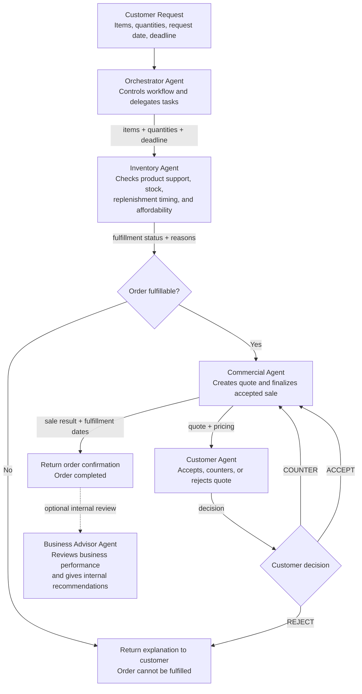

# Diagrams

## Multi-Agent System Workflow Diagrams

```mermaid
flowchart TD
    R["Customer Request<br/>Items, quantities, request date, deadline"]

    O["Orchestrator Agent<br/>Controls workflow and delegates tasks"]

    I["Inventory Agent<br/>Checks product support, stock,<br/>replenishment timing, and affordability"]

    D1{"Order fulfillable?"}

    C["Commercial Agent<br/>Creates quote and finalizes accepted sale"]

    U["Customer Agent<br/>Accepts, counters, or rejects quote"]

    D2{"Customer decision"}

    B["Business Advisor Agent<br/>Reviews business performance<br/>and gives internal recommendations"]

    X["Return explanation to customer<br/>Order cannot be fulfilled"]

    S["Return order confirmation<br/>Order completed"]

    R --> O
    O -->|"items + quantities + deadline"| I
    I -->|"fulfillment status + reasons"| D1

    D1 -->|"No"| X
    D1 -->|"Yes"| C

    C -->|"quote + pricing"| U
    U -->|"decision"| D2

    D2 -->|"COUNTER"| C
    D2 -->|"REJECT"| X
    D2 -->|"ACCEPT"| C

    C -->|"sale result + fulfillment dates"| S

    S -.->|"optional internal review"| B
```

## Agent Tools and Starter Helpers

```mermaid
flowchart TB

    %% =====================================================
    %% ROW 1 - INVENTORY
    %% =====================================================

    subgraph R1["Inventory"]
        direction LR

        I["Inventory Agent<br/>Checks fulfillment feasibility"]

        IT["check_inventory_batch()<br/><br/>Purpose:<br/>Check all requested items and determine whether the full order can be fulfilled"]

        IH["Starter helpers<br/><br/>get_stock_level()<br/>get_supplier_delivery_date()<br/>get_cash_balance()<br/><br/>Used through check_inventory()"]

        I -->|"Input: items + quantities<br/>Output: item results + overall fulfillment status"| IT
        IT -->|"Uses"| IH
    end


    %% =====================================================
    %% ROW 2 - COMMERCIAL QUOTE
    %% =====================================================

    subgraph R2["Commercial Agent - Quote Generation"]
        direction LR

        CQ["Commercial Agent<br/>Generates customer quotes"]

        QT["calculate_quote()<br/><br/>Purpose:<br/>Calculate catalog pricing, bulk discount, line totals, and final quote"]

        QH["Starter helper<br/><br/>search_quote_history()<br/><br/>Used through search_historical_quotes()"]

        CQ -->|"Input: items + quantities<br/>Output: line totals + discount + final quote"| QT
        QT -->|"Uses historical quote data from"| QH
    end


    %% =====================================================
    %% ROW 3 - COMMERCIAL HISTORY SEARCH
    %% =====================================================

    subgraph R3["Commercial Agent - Historical Quote Search"]
        direction LR

        CH["Commercial Agent<br/>Retrieves previous quote information"]

        HT["search_historical_quotes()<br/><br/>Purpose:<br/>Find relevant historical quotes for pricing context"]

        HH["Starter helper<br/><br/>search_quote_history()"]

        CH -->|"Input: search terms<br/>Output: matching historical quotes"| HT
        HT -->|"Uses"| HH
    end


    %% =====================================================
    %% ROW 4 - COMMERCIAL SALE
    %% =====================================================

    subgraph R4["Commercial Agent - Sales Fulfillment"]
        direction LR

        CS["Commercial Agent<br/>Finalizes accepted sales"]

        FT["fulfill_order_item()<br/><br/>Purpose:<br/>Fulfill accepted items, replenish shortages when needed, and record the sale"]

        FH["Starter helpers<br/><br/>get_stock_level()<br/>get_supplier_delivery_date()<br/>get_cash_balance()<br/>create_transaction()<br/><br/>reorder_inventory() used internally when stock is short"]

        CS -->|"Input: accepted item + exact quantity<br/>Output: success/failure + sale price + fulfillment date"| FT
        FT -->|"Uses"| FH
    end


    %% =====================================================
    %% ROW 5 - CUSTOMER
    %% =====================================================

    subgraph R5["Customer Agent"]
        direction LR

        U["Customer Agent<br/>Evaluates and negotiates the quote"]

        UT["No business tools<br/><br/>Uses original customer request and current quote"]

        UR["Decision<br/><br/>ACCEPT / COUNTER / REJECT"]

        U -->|"Input: request + quote"| UT
        UT -->|"Output"| UR
    end


    %% =====================================================
    %% ROW 6 - BUSINESS ADVISOR
    %% =====================================================

    subgraph R6["Business Advisor"]
        direction LR

        B["Business Advisor Agent<br/>Analyzes internal business health"]

        BT["get_business_health()<br/><br/>Purpose:<br/>Collect financial and inventory information for internal analysis"]

        BH["Starter helpers<br/><br/>generate_financial_report()<br/>get_cash_balance()<br/>get_all_inventory()"]

        B -->|"Input: as-of date<br/>Output: financial report + cash + inventory context"| BT
        BT -->|"Uses"| BH
    end


    %% =====================================================
    %% FORCE ROWS TO STACK VERTICALLY
    %% =====================================================

    IH ~~~ CQ
    QH ~~~ CH
    HH ~~~ CS
    FH ~~~ U
    UR ~~~ B
```